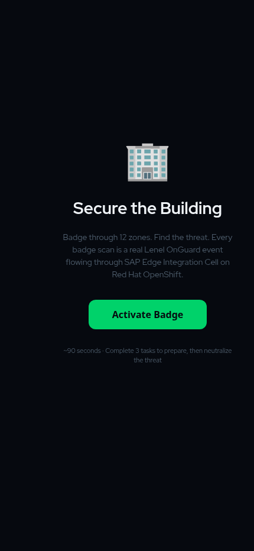

# OHC Edge Demo — Red Hat x SAP

Live interactive demo: physical security events flowing from edge devices through Red Hat OpenShift to SAP BTP via Edge Integration Cell.

## Architecture

**North is decision support. South is execution. Both are permanent.**

```
South (execution)          Middle (plumbing)              North (decision support)
─────────────────          ─────────────────              ───────────────────────
Phone / badge reader  →    Flask on OpenShift    →        Dashboard, presentations
Sensors, cameras           (event ingestion, SSE,         Evidence panel
HVAC, biometrics            telemetry, state)             ↓ (future)
                                  ↓                       SAP EIC → BTP
                            /data/state.json (PVC)
```

- **South** — device I/O. Everything that generates or acts on physical-world signals. Permanent boundary.
- **North** — enterprise integration surface. EIC, BTP, dashboards. Everything that consumes events and turns them into business meaning. Permanent boundary.
- **Middle** — replaceable. Currently Flask on OpenShift. Could be Kafka, Event Mesh, or whatever normalizes and routes events between south and north.

[View the animated architecture diagram](https://jodonnel.github.io/ohc-sap-demo/architecture.html)

## Screenshots

<p align="center">
  
</p>

## Endpoints

| Path | Description | Layer |
|------|-------------|-------|
| `/play` | Mobile wumpus game (Lenel OnGuard badge events + Chloe guide) | South |
| `/stage` | Operations dashboard (event counter, telemetry, breakdowns) | North |
| `/present` | SAP seller presentation (10 slides, live SSE counter) | North |
| `/present-rh` | Red Hat seller presentation (OHC + Partner comp) | North |
| `/present-dtw` | Demo to Win presentation (nervous system metaphor) | North |
| `/present-util` | Utilities/Energy vertical presentation | North |
| `/present-rail` | Rail/Transport vertical presentation | North |
| `/present-ad` | Active Directory / identity vertical presentation | North |
| `/present-index` | Presentation selector | North |
| `/about-panel` | System evidence panel (uptime, commit, SSE clients) | North |
| `/ingest` | POST endpoint for CloudEvents | Middle |
| `/events` | Server-Sent Events stream | Middle |
| `/state` | Current state JSON | Middle |
| `/telemetry` | Aggregated device telemetry | Middle |
| `/log` | Event history (last 200) | Middle |
| `/about` | System metadata JSON | Middle |
| `/healthz` | Liveness probe | Middle |
| `/readyz` | Readiness probe | Middle |
| `/go/<alias>` | Short URL redirects (`/go/play`, `/go/dtw`, `/go/stage`, etc.) | Middle |
| `/go` | List all short URLs | Middle |
| `/reset` | POST — reset all state | Middle |

## Running locally

```bash
cd north/
pip install flask
python app.py
# Game:          http://localhost:8080/play
# Dashboard:     http://localhost:8080/stage
# Presentation:  http://localhost:8080/present
# Send event:    curl -X POST http://localhost:8080/ingest \
#                  -H 'Content-Type: application/json' \
#                  -d '{"type":"ohc.demo.test","data":{"ping":true}}'
```

**Deploy to OpenShift:**

```bash
oc kustomize deploy/overlays/qa/ | oc apply -f -
```

## Stack

- **Red Hat OpenShift** (RHDP sandbox on AWS)
- **Python/Flask** (middle layer — event ingestion, SSE, telemetry, routing)
- **Vanilla HTML/CSS/JS** (no frameworks)
- **Server-Sent Events** (real-time push to north-side consumers)
- **CloudEvents v1.0** (structured event payloads — the contract between south and north)
- **Persistent state** (JSON flush to PVC every 10s, SIGTERM handler)
- **Red Hat fonts** (Red Hat Display, Red Hat Text, Red Hat Mono)

## Repository layout

```
.
├── south-ui/              # South: execution layer
│   └── index.html         # Mobile wumpus game (device I/O simulation)
├── north/                 # Middle + North (today colocated in one pod)
│   ├── app.py             # Middle: event ingestion, SSE, telemetry, routing
│   ├── stage/             # North: dashboards, presentations, evidence panel
│   │   ├── dashboard.html
│   │   ├── present.html, present-rh.html, present-dtw.html, ...
│   │   ├── present-index.html
│   │   ├── about.html     # Evidence panel
│   │   └── qr.html
│   ├── assets/            # Static assets (mounted via ConfigMap)
│   └── Containerfile      # UBI9/python-311 container build
├── deploy/                # GitOps-ready kustomize manifests
│   ├── base/              # Cluster-agnostic resources
│   └── overlays/qa/       # QA environment patches
├── docs/                  # GitHub Pages + architecture docs
│   ├── architecture.html  # Animated architecture diagram
│   ├── components.md      # Component interaction model
│   ├── adr/               # Architecture Decision Records
│   └── assets/chloe/      # Chloe character images (WebP)
├── transport/             # Artifact sync scripts
└── .github/               # CI, templates, community docs
```

## Built with

- **Claude Code** (Opus) — deployment, git ops, cluster management, pipeline debugging
- **Claude Web** (Opus) — UI design, game logic, presentation, architecture diagrams
- **ChatGPT** — Chloe character design, slide imagery

## Contributing

See [CONTRIBUTING.md](.github/CONTRIBUTING.md) for guidelines.

## License

[Apache-2.0](LICENSE)
